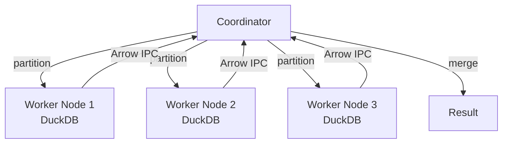

# Distributed Queries

Dux distributes analytical workloads across a BEAM cluster. Each node runs its own DuckDB instance. The coordinator partitions data, fans out pipelines, and merges results. No JVM, no YARN, no Spark — just BEAM processes and message passing.

## Architecture



## Starting workers

Each BEAM node in your cluster runs a `Dux.Remote.Worker`. Workers open a local DuckDB connection and register themselves via `:pg` for automatic discovery.

```elixir
# On each node:
{:ok, _pid} = Dux.Remote.Worker.start_link()
```

Workers auto-register in the `:dux_workers` process group. The coordinator discovers them automatically:

```elixir
Dux.Remote.Worker.list()
# [#PID<0.250.0>, #PID<25759.138.0>, #PID<25760.138.0>]
```

## Executing distributed queries

The coordinator handles everything — partition the source, fan out, merge:

```elixir
Dux.from_parquet("data/**/*.parquet")
|> Dux.filter(amount > 100)
|> Dux.group_by(:region)
|> Dux.summarise(total: sum(amount), n: count(amount))
|> Dux.Remote.Coordinator.execute()
```

> #### No function serialization {: .tip}
>
> `%Dux{}` is plain Elixir data — a source, a list of operations, column names.
> The coordinator ships this struct to each worker. The worker compiles it to SQL
> locally and executes against its own DuckDB. No lambdas cross the wire.

## How it works

1. **Partition** — For Parquet globs, files are split across workers round-robin. For other sources, each worker gets the full pipeline (useful for replicated data or database scans).

2. **Fan out** — Each worker receives a `%Dux{}` pipeline, compiles it to SQL, executes against its local DuckDB, and returns the result as Arrow IPC binary.

3. **Merge** — The coordinator collects Arrow IPC results, loads them into its local DuckDB, and runs a merge query (UNION ALL, re-sort, re-aggregate as needed).

## Broadcast joins

Star-schema analytics: broadcast a small dimension table to all workers, then each worker joins its partition of the fact table locally.

```elixir
fact = Dux.from_parquet("data/orders/**/*.parquet")
dim = Dux.from_csv("data/regions.csv")

Dux.Remote.Broadcast.execute(fact, dim, on: :region_id)
```

The broadcast flow:

1. Coordinator computes the small table and serializes to Arrow IPC
2. IPC binary is sent to all workers in parallel
3. Workers register it as a local temp table
4. Pipeline is rewritten to join against the broadcast table
5. Fan out, merge, cleanup

> #### When to broadcast {: .info}
>
> Use `Dux.Remote.Broadcast.should_broadcast?(df)` to check if a table
> is small enough (default threshold: 256MB serialized). For large-large
> joins, distributed shuffle is planned for a future release.

## Why not Spark?

| | Spark | Dux |
|---|---|---|
| **Startup** | JVM cold start (seconds) | BEAM instant (already running) |
| **Serialization** | Lambda serialization (fragile, opaque) | Ship `%Dux{}` data (plain tuples) |
| **Cluster manager** | YARN / K8s / Mesos | libcluster + `:pg` |
| **RPC** | Custom shuffle protocol | `:erpc.multicall` |
| **Fault tolerance** | Lineage graph replay | Supervisor restart + re-read from S3 |
| **Per-core perf** | Tungsten engine | DuckDB (5-10x faster) |

## Remote GC

When a computed `%Dux{}` crosses node boundaries, the underlying DuckDB temp table must stay alive on the origin node. Dux handles this automatically with a distributed garbage collector:

- A GC sentinel NIF resource on the consumer node fires when collected
- The notification propagates to a Holder process on the origin node
- The Holder releases the DuckDB resource when no consumers remain
- Node disconnection triggers immediate cleanup

You don't need to think about this — it happens transparently.

## Example: multi-node aggregation

```elixir
# Assuming 3 worker nodes are connected
workers = Dux.Remote.Worker.list()
# [#PID<node1>, #PID<node2>, #PID<node3>]

# Each worker processes its partition independently
result =
  Dux.from_parquet("s3://datalake/events/**/*.parquet")
  |> Dux.filter(event_type == "purchase")
  |> Dux.group_by(:product_category)
  |> Dux.summarise(
    revenue: sum(amount),
    orders: count(id),
    avg_order: avg(amount)
  )
  |> Dux.Remote.Coordinator.execute(workers: workers)
  |> Dux.sort_by(desc: :revenue)
  |> Dux.collect()
```
