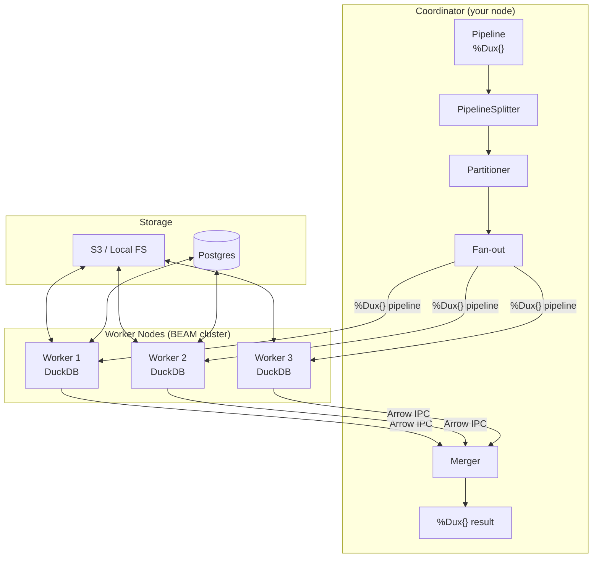
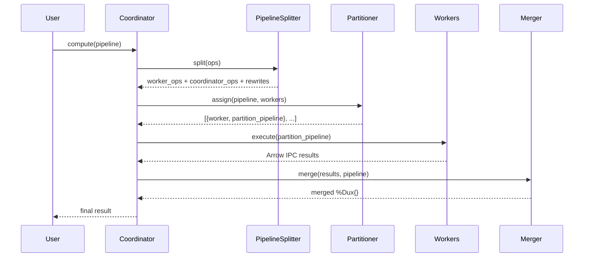
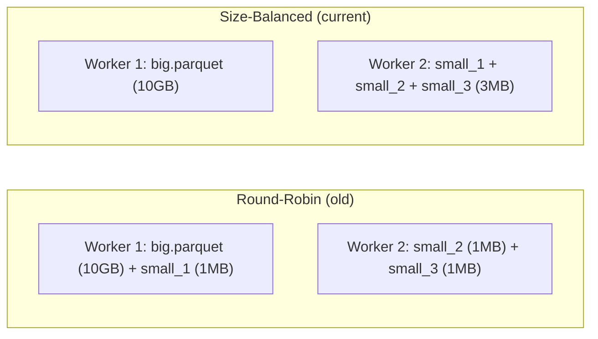
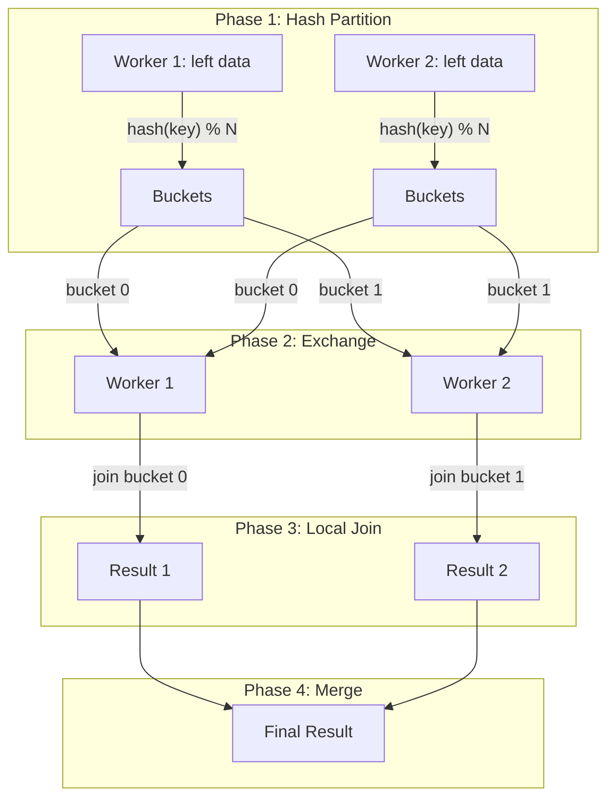

# Distributed Execution

Dux distributes queries across a cluster of DuckDB instances connected by the BEAM.
Each worker has its own embedded DuckDB — no shared state, no coordinator
bottleneck for data. This guide covers the architecture, how queries decompose,
how data moves, and how to get the best performance.

## Quick Start

```elixir
workers = Dux.Remote.Worker.list()

Dux.from_parquet("s3://lake/events/**/*.parquet")
|> Dux.distribute(workers)
|> Dux.filter(amount > 100)
|> Dux.group_by(:region)
|> Dux.summarise(total: sum(amount))
|> Dux.compute()
```

`distribute/2` is the only change. The same verbs work — Dux handles
partitioning, fan-out, and merge automatically.

## Architecture



Key design decisions:

- **`%Dux{}` is plain data.** Pipelines serialize naturally over BEAM distribution — no function serialization needed.
- **DuckDB per node.** Each worker compiles SQL from the pipeline independently. No shared query plan.
- **Arrow IPC for results.** Workers return results as Arrow IPC binaries — compact, zero-copy deserializable.
- **`:pg` for discovery.** Workers register in a `:pg` process group. The coordinator discovers them automatically.

## Workers

Workers are GenServers with their own DuckDB connections:

```elixir
# Local workers (for development)
{:ok, w1} = Dux.Remote.Worker.start_link()
{:ok, w2} = Dux.Remote.Worker.start_link()

# Remote workers (production — on separate BEAM nodes)
{:ok, w} = :erpc.call(remote_node, Dux.Remote.Worker, :start_link, [[]])

# Discover all registered workers
workers = Dux.Remote.Worker.list()
```

### FLAME: Elastic Cloud Workers

[FLAME](https://github.com/phoenixframework/flame) boots ephemeral cloud
machines with a full copy of your application. Combined with Dux, each runner
gets its own DuckDB, reads S3 data directly, and auto-terminates when idle.

#### Livebook on Fly.io

```elixir
# 1. Start a FLAME pool
Kino.start_child!(
  {FLAME.Pool,
    name: :dux_pool,
    code_sync: [
      start_apps: true,
      sync_beams: [Path.join(System.tmp_dir!(), "livebook_runtime")]
    ],
    min: 0,
    max: 10,
    max_concurrency: 1,
    backend: {FLAME.FlyBackend,
      cpu_kind: "performance", cpus: 4, memory_mb: 8192,
      token: System.fetch_env!("FLY_API_TOKEN"),
      env: %{"LIVEBOOK_COOKIE" => Atom.to_string(Node.get_cookie())}
    },
    boot_timeout: 120_000,
    idle_shutdown_after: :timer.minutes(5)}
)

# 2. Spin up workers
workers = Dux.Flame.spin_up(5, pool: :dux_pool)
```

Key Livebook-specific settings:

- **`Kino.start_child!/1`** — supervises the pool under Livebook's runtime
- **`sync_beams`** — syncs notebook-compiled beam files to runners
- **`start_apps: true`** — starts all applications (including `:dux`) on runners
- **`LIVEBOOK_COOKIE`** — required for BEAM distribution between nodes (use `Node.get_cookie()`, not the env var)
- **`max_concurrency: 1`** — one DuckDB worker per machine. DuckDB saturates cores internally; multiple workers on one machine just adds contention.

#### Deployed Elixir app

Add the FLAME pool to your application supervision tree:

```elixir
# In your application.ex children:
children = [
  {FLAME.Pool,
    name: :dux_pool,
    max_concurrency: 1,
    backend: {FLAME.FlyBackend,
      token: System.fetch_env!("FLY_API_TOKEN"),
      cpus: 4, memory_mb: 16_384},
    max: 10,
    code_sync: [start_apps: [:dux], copy_apps: true],
    idle_shutdown_after: :timer.minutes(5)}
]
```

Then at runtime:

```elixir
workers = Dux.Flame.spin_up(5, pool: :dux_pool)
```

#### Using FLAME workers

Once spun up, FLAME workers are just worker PIDs — `distribute/2` doesn't
know or care whether they're FLAME runners or static cluster nodes:

```elixir
workers = Dux.Flame.spin_up(5, pool: :dux_pool)

Dux.from_parquet("s3://lake/events/**/*.parquet")
|> Dux.distribute(workers)
|> Dux.filter(amount > 100)
|> Dux.group_by(:region)
|> Dux.summarise(total: sum(amount))
|> Dux.compute()
```

Workers read S3 directly — no data flows through your machine. After the
idle timeout, FLAME terminates the runners automatically.

## Query Decomposition

When you call `compute/1` on a distributed pipeline, the Coordinator runs a
multi-stage process:



### Pipeline Splitting

The `PipelineSplitter` classifies each operation as worker-safe or
coordinator-only:

| Worker-safe (pushed down) | Coordinator-only (post-merge) |
|---------------------------|-------------------------------|
| `filter`, `mutate`, `select`, `discard` | `slice` (positional) |
| `rename`, `drop_nil` | `pivot_wider`, `pivot_longer` |
| `group_by`, `ungroup`, `summarise` | |
| `sort_by`, `head`, `distinct` | |
| `join`, `asof_join`, `concat_rows` | |

Operations like `sort_by` and `head` are **both** pushed to workers (for
early reduction) and re-applied on the coordinator (for correctness).

### Aggregate Rewrites

Aggregates need special handling in distributed execution. The
PipelineSplitter rewrites them so workers compute partial results and the
coordinator combines them correctly:

| Aggregate | Worker computes | Coordinator computes |
|-----------|----------------|---------------------|
| `SUM(x)` | `SUM(x)` | `SUM(partial_sums)` |
| `COUNT(*)` | `COUNT(*)` | `SUM(partial_counts)` |
| `MIN(x)` / `MAX(x)` | `MIN(x)` / `MAX(x)` | `MIN(partial_mins)` / `MAX(partial_maxs)` |
| `AVG(x)` | `SUM(x)`, `COUNT(x)` | `SUM(sums) / SUM(counts)` |
| `STDDEV(x)` | `COUNT(x)`, `AVG(x)`, `VAR_POP(x)*COUNT(x)` | Welford's parallel merge |
| `COUNT(DISTINCT x)` | `approx_count_distinct(x)` | `SUM(hll_estimates)` |

The Welford merge for STDDEV/VARIANCE is numerically stable — no catastrophic
cancellation even with large values close together.

### Streaming Merger

When all aggregates are **lattice-compatible** (SUM, COUNT, MIN, MAX, Welford
variance), the merger can fold results incrementally as workers complete —
no need to wait for all workers before starting the merge.

Lattice-compatible means the merge operation is associative and commutative:
`merge(merge(a, b), c) == merge(a, merge(b, c))`.

## Data Partitioning

### Parquet: Size-Balanced Assignment

For Parquet globs, the Partitioner expands the glob and assigns files to
workers using greedy bin-packing by file size:



File sizes come from:
- **Local files:** `File.stat` (instant)
- **S3 globs:** `ListObjectsV2` (already called during glob expansion — free)
- **DuckLake:** catalog query (`ducklake_data_file.file_size_bytes`)

### Hive Partition Pruning

For Hive-partitioned datasets (`year=2024/month=01/data.parquet`), the
Partitioner automatically skips files whose partition values don't match
pipeline filters before distributing:

```elixir
Dux.from_parquet("s3://lake/events/**/*.parquet")
|> Dux.distribute(workers)
|> Dux.filter(year == 2024)    # only year=2024 files are read
|> Dux.compute()
```

Pruning handles simple equality and AND predicates on partition columns.
Complex expressions are not pruned (safe — just reads more data than necessary).

### Postgres: Hash-Partitioned Reads

For attached databases, `partition_by:` enables distributed reads. Each
worker ATTACHes the database and reads a disjoint hash partition:

```elixir
Dux.attach(:pg, "host=db.internal dbname=analytics", type: :postgres)

Dux.from_attached(:pg, "public.orders", partition_by: :id)
|> Dux.distribute(workers)
|> Dux.compute()
```

Each worker executes `WHERE hash(id) % N = worker_idx` — DuckDB pushes
this filter to Postgres, so each worker only transfers 1/N of the data.

Without `partition_by:`, attached sources are coordinator-only (used for
broadcast joins with dimension tables).

### Source Safety Classification

The Coordinator classifies each source type:

| Source | Worker-safe? | Partitioning |
|--------|-------------|--------------|
| Parquet glob | Yes | File-level, size-balanced |
| Parquet single file | Yes | Replicated |
| CSV / NDJSON | Yes | Replicated |
| `from_query` / `from_list` | Yes | Replicated |
| DuckLake | Yes | File manifest |
| Attached + `partition_by:` | Yes | Hash-partitioned |
| Attached (no partition_by) | No | Coordinator-only |
| Table ref | No | Materialized to list |

"Replicated" means every worker gets the full data — appropriate for small
datasets but wasteful for large ones. Use Parquet globs for true partitioning.

## Joins

### Broadcast Joins

When a distributed pipeline joins with a small table, the Coordinator
automatically broadcasts the small table to all workers:

```elixir
facts = Dux.from_parquet("s3://lake/orders/**/*.parquet")
        |> Dux.distribute(workers)

dim = Dux.from_attached(:pg, "public.customers") |> Dux.compute()

facts
|> Dux.join(dim, on: :customer_id)
|> Dux.group_by(:region)
|> Dux.summarise(total: sum(amount))
|> Dux.compute()
```

The Coordinator:
1. Detects the right side is not worker-safe
2. Materializes it locally as Arrow IPC
3. Sends the IPC to all workers (broadcast)
4. Workers execute the join locally

The broadcast threshold is 256 MB. Right sides larger than this trigger
a shuffle join instead.

### Shuffle Joins

For large-large joins where neither side fits in broadcast, Dux uses a
4-phase hash shuffle:



The shuffle over-partitions 4x to absorb moderate data skew. Skew detection
(buckets > 5x median size) emits telemetry warnings.

## Distributed Writes

### Parallel File Writes

When a distributed pipeline writes files, each worker writes its partition
directly to storage:

```elixir
Dux.from_parquet("s3://input/**/*.parquet")
|> Dux.distribute(workers)
|> Dux.filter(status == "active")
|> Dux.to_parquet("s3://output/result/")
# Worker 1 writes: part_0_12345.parquet
# Worker 2 writes: part_1_12346.parquet
```

File names include the worker index and a unique ID to prevent collisions.
The coordinator never touches the data — it only collects status.

### Hive-Partitioned Output

```elixir
Dux.from_parquet("s3://input/**/*.parquet")
|> Dux.distribute(workers)
|> Dux.to_parquet("s3://output/events/", partition_by: [:year, :month])
```

Each worker writes to its own subdirectory to avoid concurrent directory
creation races. Readers use `**/*.parquet` to find all files.

### Distributed `insert_into`

```elixir
Dux.attach(:pg, conn_string, type: :postgres, read_only: false)

Dux.from_parquet("s3://input/**/*.parquet")
|> Dux.distribute(workers)
|> Dux.insert_into("pg.public.events", create: true)
```

Each worker ATTACHes the target database and INSERTs its partition. For
`create: true`, the first worker creates the table sequentially, then the
rest INSERT in parallel. Per-worker transactions — not atomic across workers.

## Performance Considerations

### Choose the right source type

| Scenario | Best source | Why |
|----------|------------|-----|
| Large dataset, many files | Parquet glob | True file-level partitioning |
| Single large file | Not ideal for distribution | Can't split a single file |
| Database table | `partition_by:` on `from_attached` | Hash-partitioned reads |
| Small lookup table | `from_list` or `from_attached` (no partition_by) | Auto-broadcast |

### Partition count vs worker count

Aim for 2-4x more partitions (files) than workers. Too few partitions means
some workers sit idle. Too many means overhead from many small reads.

### Avoid replicated aggregation surprises

When distributing `from_list` or `from_query` (non-partitioned sources), each
worker gets the full dataset. Aggregations like `SUM` are re-aggregated
correctly, but `COUNT(*)` will be N_workers times the actual count. Use
Parquet globs for true partitioning.

### Broadcast threshold

The default broadcast threshold is 256 MB. Right sides of joins smaller than
this are broadcast; larger ones trigger a shuffle. The threshold is configurable:

```elixir
Dux.compute(pipeline, broadcast_threshold: 512 * 1024 * 1024)  # 512 MB
```

## Fault Tolerance

| Scenario | Behavior |
|----------|----------|
| Worker fails during read | Coordinator raises with error details |
| Worker fails during file write | Retry on surviving worker; orphan files have unique IDs |
| Worker fails during insert_into | Warning logged; surviving workers' inserts commit |
| All workers fail | `ArgumentError` raised with all error reasons |

Workers are stateless — they compile SQL from the `%Dux{}` struct on each
execution. No recovery protocol needed; just retry the pipeline.

## Telemetry

Dux emits `:telemetry` events for distributed operations:

| Event | Measurements | Metadata |
|-------|-------------|----------|
| `[:dux, :distributed, :fan_out, :start]` | — | `n_workers` |
| `[:dux, :distributed, :fan_out, :stop]` | `duration` | `n_workers` |
| `[:dux, :distributed, :worker, :stop]` | `duration`, `ipc_bytes` | `worker_index`, `n_workers` |
| `[:dux, :distributed, :merge, :start]` | — | `n_results` |
| `[:dux, :distributed, :merge, :stop]` | `duration` | `n_results` |
| `[:dux, :distributed, :write, :start]` | — | `format`, `path`, `n_workers` |
| `[:dux, :distributed, :write, :stop]` | `duration` | `n_files` |

```elixir
:telemetry.attach("dist-monitor", [:dux, :distributed, :worker, :stop],
  fn _event, measures, meta, _ ->
    ms = div(measures.duration, 1_000_000)
    kb = div(measures.ipc_bytes, 1024)
    IO.puts("Worker #{meta.worker_index + 1}/#{meta.n_workers}: #{ms}ms, #{kb} KB")
  end, nil)
```

## What's Next

- [Getting Started](getting-started.livemd) — core Dux concepts
- [Data IO](data-io.livemd) — reading and writing files
- [Joins & Reshape](joins-and-reshape.livemd) — join types, ASOF, pivots
- [Graph Analytics](graph-analytics.livemd) — distributed graph algorithms
